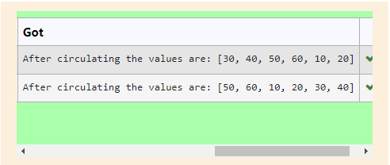

# Circulate-the-values-of-N-variables
## Aim:
To write a python program to circulate the n variables using function concept
## Equipment’s required:
PC
Anaconda - Python 3.7
## Algorithm: 
### Step 1: 
get the values from the user.
### Step 2: 
get input to circulate number of values.
### Step 3: 
circulate the number of values in list according to input

### Step 4: 
print the values after circulating
 
## Program:
```
def circulate():
    l=[10,20,30,40,50,60]
    
    n=int(input(""))
    l=l[n:]+l[:n]
    print("After circulating the values are:",l)
```

## Output:


## Result:
Thus the program to circulate the values in list is done successully :)
